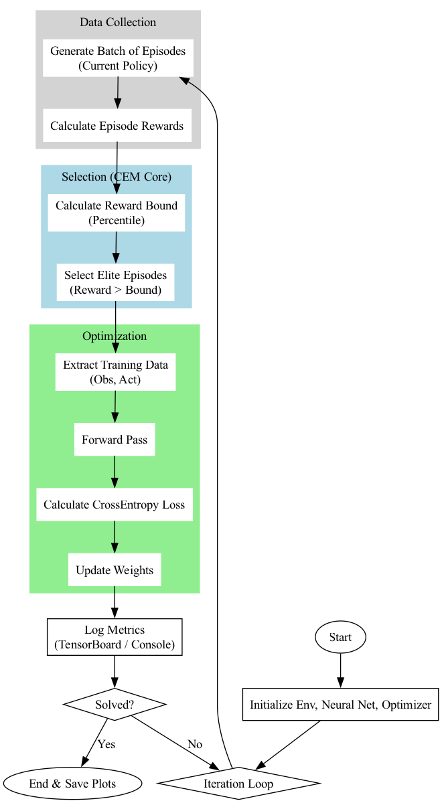
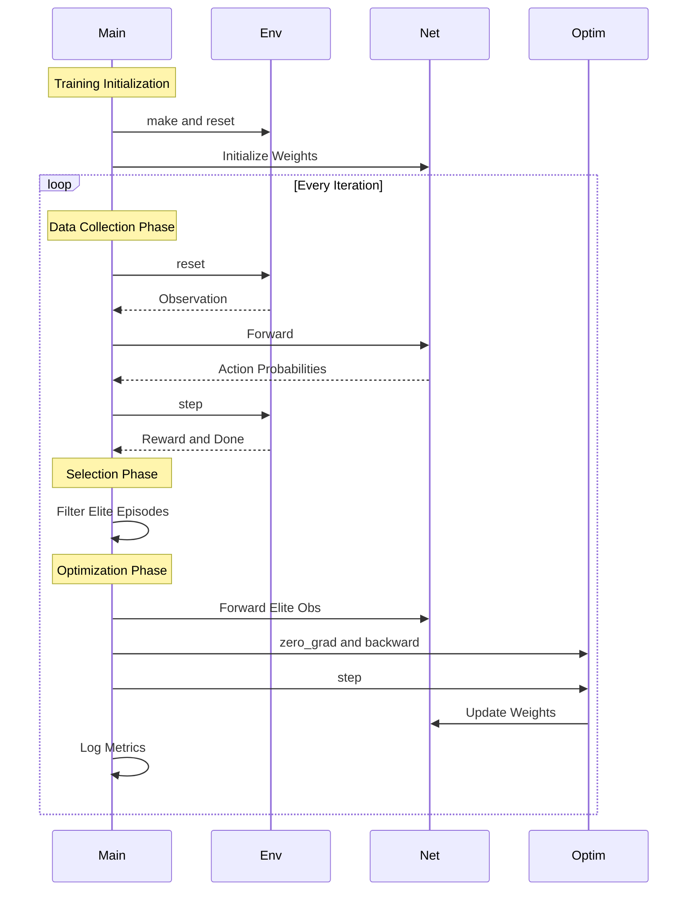

# Cross-Entropy Method (CEM) for Reinforcement Learning

This repository implements the Cross-Entropy Method (CEM) for solving Reinforcement Learning environments, specifically **CartPole-v1**.

We provide two distinct implementations to demonstrate different policy representations:
1.  **Vector/Linear Policy** (`cem_carpole_vector.py`)
2.  **Neural Network Policy** (`cem_cartpole_nn.py`)

## Implementations

### 1. Vector (Linear) Policy
*   **File**: `cem_carpole_vector.py`
*   **Description**: Uses a simple linear weight matrix (vector) to map observations directly to actions.
*   **Characteristics**:
    *   Extremely fast convergence (often solves CartPole in <10 iterations).
    *   Low computational overhead.
    *   Limited to simple problems where a linear decision boundary suffices.

### 2. Neural Network Policy
*   **File**: `cem_cartpole_nn.py`
*   **Description**: Uses a PyTorch-based Deep Neural Network (MLP) to approximate the policy.
*   **Characteristics**:
    *   Can model complex, non-linear relationships.
    *   Slower convergence compared to the linear policy on simple tasks.
    *   More generalizable to complex environments.

## Usage

### Prerequisites
Install the required dependencies:
```bash
pip install gymnasium numpy torch tensorboardX matplotlib
```

### Running the Experiments
Run both scripts to generate training logs:

```bash
# Run Vector implementation (Linear Policy)
python cem_carpole_vector.py

# Run Neural Network implementation
python cem_cartpole_nn.py
```

### Visualization & Comparison (TensorBoard)
Both scripts log unified metrics to TensorBoard for easy side-by-side comparison.

To view results:
```bash
tensorboard --logdir runs
```
Open your browser at `http://localhost:6006`.

**Key Metrics to Compare:**
*   **`Reward/Mean`**: Average reward of the batch.
*   **`Reward/Bound`**: The reward threshold (70th percentile) used to select "elite" episodes.
*   **`Reward/Running`**: Smoothed running average reward (Best for tracking overall progress).
*   **`Reward/Max`**: Maximum reward achieved in the current batch.

---

## Environments

### CartPole-v1
*   **Goal**: Balance a pole on a cart by moving left or right.
*   **Success Criterion**: Average reward > 195 (or 475 in v1) over 100 trials. Our scripts run for 100 iterations to show stability.

### FrozenLake (Archive)
*   **File**: `frozen_lake.py`
*   **Goal**: Navigate a slippery grid to reach the goal without falling into holes.

---

## Code Architecture (Cross-Entropy Method)



## Sequence Diagram


