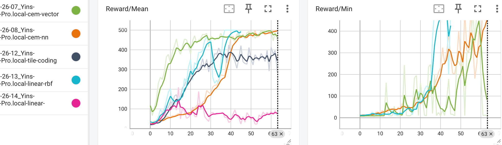
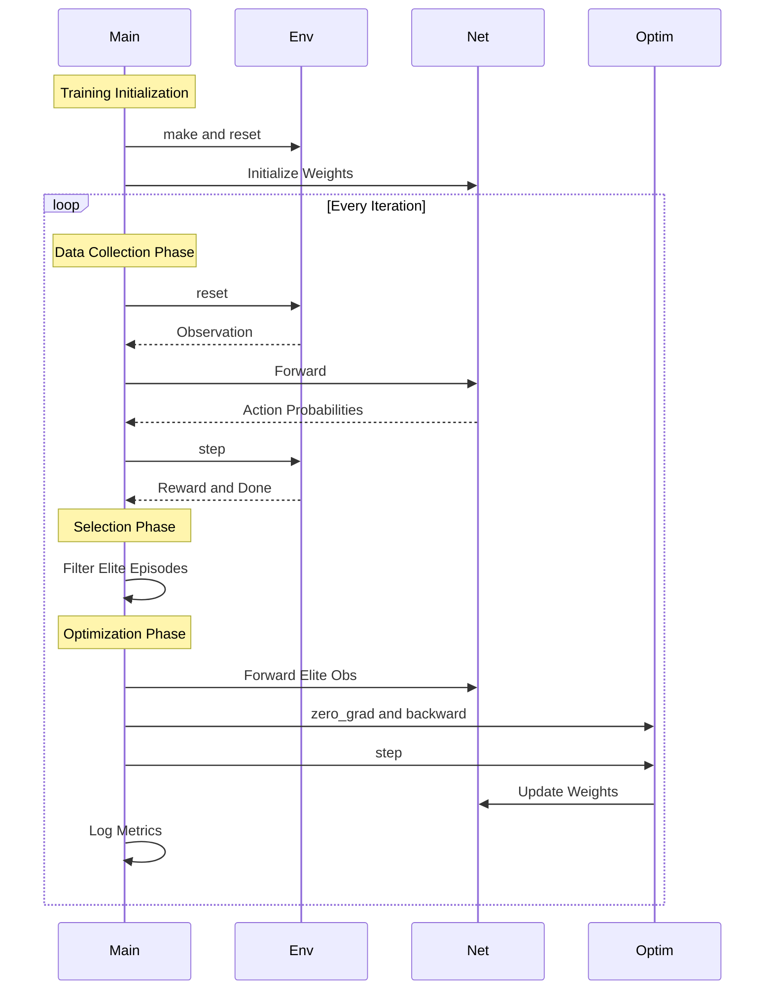

# Cross-Entropy Method (CEM) for Reinforcement Learning

This repository implements the Cross-Entropy Method (CEM) for solving Reinforcement Learning environments, specifically **CartPole-v1**. We provide two distinct implementations to demonstrate different policy representations:



The linear(vector) version is much efficient than neural network(nn) version, while the min reward may have higher fluctation. The nn version has quite steady up going curve, indicating its stablity in learning. In the mean time, RBF-QLearning also performs well while slow.

1. **Vector/Linear Policy** (`cem_carpole_vector.py`) ✅
2. **Neural Network Policy** (`cem_cartpole_nn.py`) ✅
3. **RBF QLearning** (`RBF_Qlearning_cartpole.py`) ❌ too slow
4. **Tabular QLearning** (`Qlearning_cartpole.py`) ❌
5. **Tabular SARSA** (`SARSA_cartpole.py`) ❌
6. **Fourier QLearning** (`Fourier_Qlearning_cartpole.py`) ❌
7. **Tile Coding QLearning** (`TileCoding_Qlearning_cartpole.py`) ✅

Best performance: VectorCEM, NNCEM, RBFQlearning, TileCodingQlearning

## Implementations

### 1. Vector (Linear) Policy

* **File**: `cem_carpole_vector.py`
* **Description**: Uses a simple linear weight matrix (vector) to map observations directly to actions.
* **Characteristics**:
  * Extremely fast convergence (often solves CartPole in <10 iterations).
  * Low computational overhead.
  * Limited to simple problems where a linear decision boundary suffices.

### 2. Neural Network Policy

* **File**: `cem_cartpole_nn.py`
* **Description**: Uses a PyTorch-based Deep Neural Network (MLP) to approximate the policy.
* **Characteristics**:
  * Can model complex, non-linear relationships.
  * Slower convergence compared to the linear policy on simple tasks.
  * More generalizable to complex environments.

### 3. Tabular Q-learning

* **File**: `Qlearning_cartpole.py`
* **Description**: Classic Q-learning with state **discretization** (binning).
* **Characteristics**:
  * **Off-Policy**: Learns the optimal value function independently of the agent's actions.
  * Requires manually discretizing the continuous state space into grids (bins).
  * Slower convergence due to the large number of states to explore.

### 4. Tabular SARSA

* **File**: `SARSA_cartpole.py`
* **Description**: On-policy SARSA algorithm with state discretization.
* **Characteristics**:
  * **On-Policy**: Learns the value of the policy being followed (including exploration noise).
  * Generally more stable but conservative than Q-learning.

### 5. Linear Q-learning with RBF (Radial Basis Functions)

* **File**: `RBF_Qlearning_cartpole.py`
* **Description**: Q-learning using **Linear Function Approximation** with RBF features.
* **Characteristics**:
  * **No Discretization**: Handles continuous state space directly by projecting states into a high-dimensional feature space.
  * **Fast Convergence**: Solves CartPole very quickly, demonstrating the power of feature engineering.
  * *Note*: Also includes `linear_raw_cartpole.py` as a negative example to show why simple linear models fail without RBF projection.

### 6. Linear Q-learning with Fourier Basis

* **File**: `Fourier_Qlearning_cartpole.py`
* **Description**: Q-learning using **Fourier Basis** functions for global function approximation.
* **Characteristics**:
  * **Global Approximation**: Unlike RBF (local), Fourier features capture global trends across the state space.
  * **Parameter Efficiency**: Often requires fewer parameters than RBF for smooth physical systems.
  * Based on *Konidaris et al. (2011)*.

### 7. Linear Q-learning with Tile Coding

* **File**: `TileCoding_Qlearning_cartpole.py`
* **Description**: Q-learning using **Tile Coding** (CMAC) for sparse, efficient local function approximation.
* **Characteristics**:
  * **Efficiency**: Extremely fast computation (only integer arithmetic and bitwise operations).
  * **Sparse**: Uses multiple overlapping grids (tilings) to represent state.
  * **History**: The "gold standard" for linear RL before deep learning.

## Benchmark Summary

Based on comparative experiments (64 iterations, max 500 steps):

| Algorithm                        | Stability  | Performance         | Execution Speed     | Notes                                                                |
| :------------------------------- | :--------- | :------------------ | :------------------ | :------------------------------------------------------------------- |
| **CEM (Neural Network)**   | ⭐⭐⭐⭐⭐ | **Excellent** | Medium              | Most robust, consistently reaches and maintains 500 reward.          |
| **CEM (Vector)**           | ⭐⭐⭐     | Good                | **Very Fast** | Extremely fast convergence but exhibits high variance (instability). |
| **Tile Coding Q-Learning** | ⭐⭐⭐⭐   | Good                | **Fast**      | Best balance of computational speed and learning performance.        |
| **RBF Q-Learning**         | ⭐⭐⭐⭐   | Good                | **Slow**      | Good sample efficiency but computationally expensive (very slow).    |
| **Fourier Q-Learning**     | ⭐         | Poor                | Medium              | Performed poorly in experiments; not recommended for this setup.     |

**Key Takeaways**:

1. **CEM (NN)** is the winner for stability and final performance.
2. **Tile Coding** is the best choice for low-latency/embedded applications.
3. **RBF** provides good results but is computationally too heavy (slow).
4. **Fourier Basis** failed to perform adequately in this comparison.

## Usage

### Prerequisites

Install the required dependencies:

```bash
pip install gymnasium numpy torch tensorboardX matplotlib
```

### Running the Experiments

Run both scripts to generate training logs:

```bash
# Run Vector implementation (Linear Policy)
python cem_carpole_vector.py

# Run Neural Network implementation
python cem_cartpole_nn.py

# Run Value-Based methods
python Qlearning_cartpole.py
python SARSA_cartpole.py
python RBF_Qlearning_cartpole.py
python Fourier_Qlearning_cartpole.py
python TileCoding_Qlearning_cartpole.py
```

### Visualization & Comparison (TensorBoard)

Both scripts log unified metrics to TensorBoard for easy side-by-side comparison.

To view results:

```bash
tensorboard --logdir runs
```

Open your browser at `http://localhost:6006`.

**Key Metrics to Compare:**

* **`Reward/Mean`**: Average reward of the batch.
* **`Reward/Bound`**: The reward threshold (70th percentile) used to select "elite" episodes.
* **`Reward/Running`**: Smoothed running average reward (Best for tracking overall progress).
* **`Reward/Max`**: Maximum reward achieved in the current batch.

---

## Environments

### CartPole-v1

* **Goal**: Balance a pole on a cart by moving left or right.
* **Success Criterion**: Average reward > 195 (or 475 in v1) over 100 trials. Our scripts run for 100 iterations to show stability.

### FrozenLake (Archive)

* **File**: `frozen_lake.py`
* **Goal**: Navigate a slippery grid to reach the goal without falling into holes.

---

## Code Architecture (Cross-Entropy Method)


## Sequence Diagram


